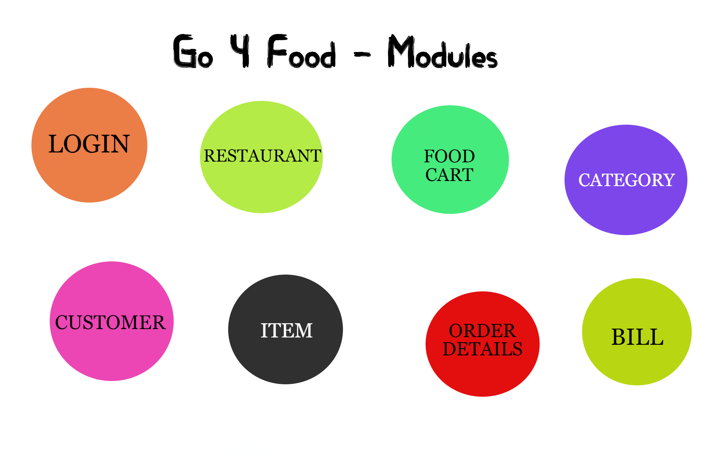

# Go 4 Food - Online Food Delivery System

# Individual Project

## Online Food Delivery App(Go 4 Food) strictly followed MVC architecture.

# Modules

# Models(Relationship Table) : 

# Services(Functionalities) : 

# Basic flow of functionality : 
- User can register
- can login/logout
- can view all items
- can view restaurant
- can add to food cart
- can get order details
- can get bill 

# Tech Stacks : 
- Java
- Spring Boot
- Spring Data JPA
- JPQL
- MYSQL
- Swagger
- Lombok

